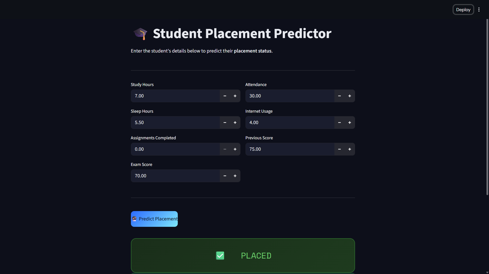
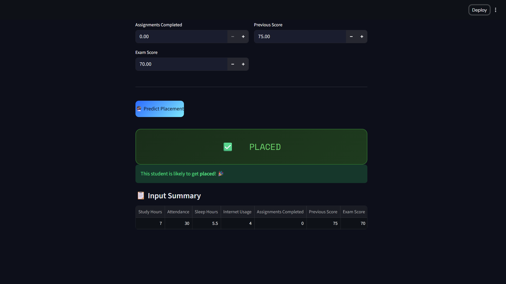

# Student Placement Predictor

This project is a Streamlit web app that predicts whether a student is likely to be placed based on academic and lifestyle inputs.

## Overview

The app loads a trained machine learning model and uses student data entered in the UI to generate a placement prediction.

## Screenshots

### Screenshot 1



### Screenshot 2




## Features

- Simple Streamlit interface
- Input form for student performance and study habits
- Placement prediction using saved model artifacts
- Input summary table after prediction

## Input Fields

The app currently uses these features:

- `study_hours`
- `attendance`
- `sleep_hours`
- `internet_usage`
- `assignments_completed`
- `previous_score`
- `exam_score`

## Project Files

- `app.py` - Streamlit application
- `student_placement_model.pkl` - trained machine learning model
- `scaler_student.pkl` - preprocessing/scaling artifact
- `student_coolumns.pkl` - saved feature column order
- `student_dataset.ipynb` - notebook used for analysis or training
- `student_dataset_10000_rows.csv` - dataset file

## Requirements

Install the required Python packages:

```bash
pip install streamlit pandas numpy joblib scikit-learn
```

## Run the App

Start the Streamlit app with:

```bash
streamlit run app.py
```

Then open the local URL shown in the terminal, usually:

```text
http://localhost:8501
```

## How It Works

1. The app loads the saved model, scaler, and feature columns.
2. You enter student values in the form.
3. The input is arranged in the expected column order.
4. The model predicts whether the student is likely to be placed.

## Notes

- Keep all `.pkl` files in the same folder as `app.py`.
- If you retrain the model, replace the artifact files with the new versions.
- The feature names in `student_coolumns.pkl` must match the app inputs.

## Future Improvements

- Add model accuracy and evaluation metrics
- Show prediction confidence
- Add charts for input analysis
- Include better validation and error handling
